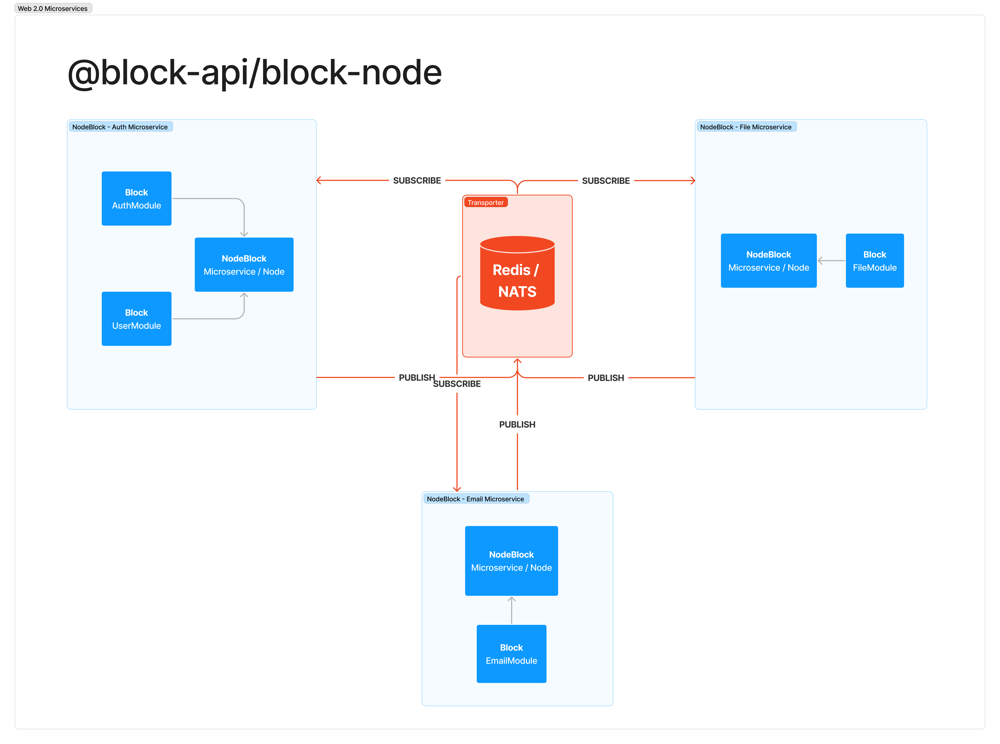
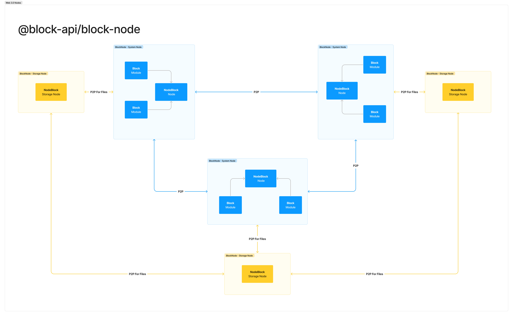

# @block-api/block-node

<p align="center" width="100%">

</p>

```text
█▄▄ █░░ █▀█ █▀▀ █▄▀ ▄▄ █▄░█ █▀█ █▀▄ █▀▀
█▄█ █▄▄ █▄█ █▄▄ █░█ ░░ █░▀█ █▄█ █▄▀ ██▄
```

> :warning: **This project is in development**: Do not use in production environment!

- [Overview](#overview)
- [Configuration](./docs/configuration.md)
- [Examples](#examples)
- [TBD](#tbd)

- [Overview](#overview)
- [Configuration](#configuration)
- [How it works](#how-it-works)
  - [P2P](/docs/p2p.md)
  - [Redis/Nats](/docs/redis_nats.md)
  - [Database](/docs/database.md)
  - [File Storage](/docs/file_storage.md)
- [TBD](#tbd)

## Overview

**block-node** is open source, framework written in Go language for building microservices and decentralized systems.

Main purpose of this project is to provide communication layer between nodes allowing you to focus on buidling application layer on top of it.

Supported communication methods:

- [x] Redis
- [ ] NATS
- [ ] P2P

**block-node** is using [*LevelDB*](https://github.com/syndtr/goleveldb) database for storing internal data (eg. information about current topology of the network). You can configure additional *LevelDB* databases in [config file](./docs/configuration.md) which can be utilized for project needs. 

In the future we will provide support for additional databases:

- [x] LevelDB
- [ ] SQLite
- [ ] PostgreSQL

**Below you can find infratructure examples** 

**Web 2.0 example**


**Web 3.0 example**


## Examples

In our other repository [https://github.com/block-api/block-node-example](https://github.com/block-api/block-node-example) you can find example implementation with exposed HTTP endpoints.

## TBD

This section presents features to be discussed if they should be implemented in the future:

**Communication:**

- `TCP`
- `WebSockets`
- `HTTP` (eg. for REST API)

**Security:**

- Generation of ETH wallet for node, pub/priv keys, for identification and to sign&verify data which are being sent over the network

**Others:**

- Command like upload files to node - ak'a file storage
  - compressing files before sending to node
  - options if distributed and kept on node itself or on separate "storage" type node, or on cloud storage like s3/azure blob

## Contact & Support

If you have any questions or ideas feel free to reach us out on [twitter](https://twitter.com/blockapi_dev).

To support development of this project you can donate at this address:<br>
`blockapi.wallet` - `0x7a42639f09729eb02de32f1dd21447806cc52ba8`.
